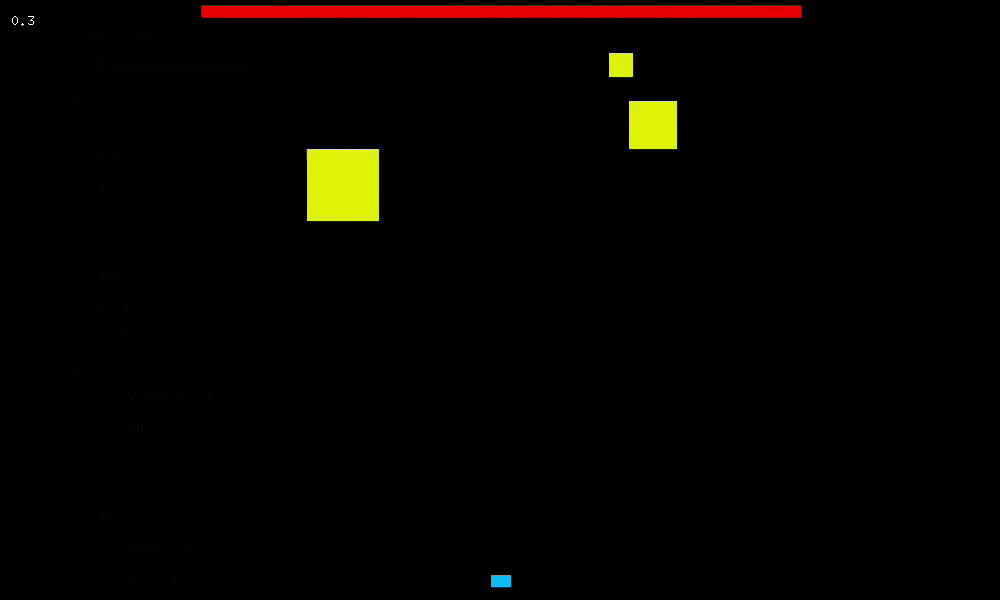

# Physical Simulations

This repository contains physical simulations developed for the **Physical Basics of Computer Games** course.

## Examples

1. **Inclined Plane Simulation**  

   

      
   

   

      <i>Classical physics simulation of a block being pulled up an inclined plane</i>
   

2. **Momentum-Based Space Shooter**  

   

      
   

   

      <i>Arcade-style game demonstrating conservation of momentum</i>
   

3. **Ball Collision Simulation**  

   

      
   

   

      <i>Simulation of elastic collisions between two balls and with static walls</i>
   

## Requirements

- OpenGL / GLUT
- C/C++ Compiler

## Run

Each project is standalone. Navigate into the respective folder and build using `make`.

